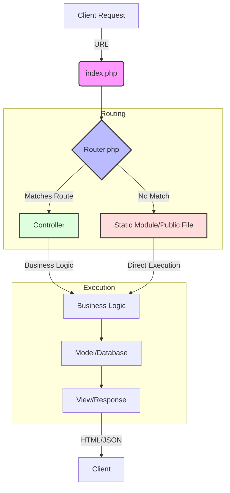

# Human Resource Management System (HRMS)
## Complete System Structure (Enterprise Standard)

---

## 1. Super Admin / System Administrator
**Purpose:** System-wide control, security, configuration, and audit.

### 1.1 System Settings
- Company / Organization create
- System basic configuration
- Enable / Disable core modules
- Global system settings lock
- Email / Notification Settings

### 1.2 Role & Access Control (RBAC)
- Role create / update / delete
-Permission matrix define
- Module-wise access control
- Dashboard access control
-Critical permission lock (Payroll, Audit, Security)

### 1.3 Super-Level User Control
- Create / Disable Admin & HR accounts
- Force password reset
- Account lock / unlock
- Access revoke (emergency)


### 1.4 Audit & Compliance
- Activity Audit Log
- Login History
- Data Change History
- Compliance Reports

### 1.5 Backup & Maintenance
- Database Backup
- Restore System
- System Health Monitoring

---

## 2. Admin (Company Administrator)
**Purpose:** Organization setup and master data management.

### 2.1 Organization Setup
- Company Profile
- Department Management
- Designation Management
- Reporting Hierarchy

### 2.2 Policy Management
- Company Policies
- HR Policy Configuration
- Leave Policy
- Attendance Policy
- Payroll Policy

### 2.3 Holiday & Calendar
- Holiday Calendar
- Weekly Off Configuration
- Festival Calendar

---

## 3. Human Resource Manager / HR Executive
**Purpose:** Employee lifecycle, HR operations, and compliance.

---

### 3.1 Employee Management
- Employee List
- Add / Edit Employee
- Employee Profile
- Document Upload & Verification
- Employment Status Management

---

### 3.2 Recruitment & Applicant Tracking System (ATS)
- Job Requisition
- Job Posting
- Candidate Database
- Resume Parsing
- Interview Scheduling
- Interview Feedback
- Offer Letter Generation
- Hiring Status Tracking
- Candidate Onboarding Trigger

---

### 3.3 Onboarding & Offboarding
#### Onboarding
- Offer Acceptance
- Document Submission
- Joining Checklist
- Probation Tracking
- Asset Assignment

#### Offboarding
- Resignation Management
- Notice Period Tracking
- Exit Interview
- Clearance Checklist
- Final Settlement Approval

---

### 3.4 Attendance Management
- Daily Attendance
- Monthly Attendance
- QR code scan Integration
- Manual Attendance Correction
- Late / Early / Overtime Tracking
- Attendance Approval
- Attendance Reports

---

### 3.5 Shift & Roster Management
- Shift Definition
- Shift Assignment
- Weekly Roster
- Night Shift Rules
- Rotational Shift Management

---

### 3.6 Leave Management
- Leave Types
- Leave Policy
- Leave Application
- Leave Approval Workflow
- Leave Balance
- Leave Reports

---

### 3.7 Payroll Management
- Salary Structure
- Allowance & Deduction Rules
- Tax Configuration
- Overtime & Bonus Rules
- Generate Payroll
- Payslip Management
- Payroll Approval
- Payroll Reports

---

### 3.8 Performance Management
- KPI Setup
- Goal Assignment
- Performance Review
- Appraisal Cycle
- Performance History

---

### 3.9 Training & Development (L&D)
- Training Programs
- Skill Matrix
- Training Enrollment
- Certification Tracking
- Training Feedback

---

### 3.10 Asset Management
- Asset Inventory
- Asset Assignment
- Asset Return
- Damage / Loss Tracking

---

### 3.11 Expense & Reimbursement
- Expense Claim Submission
- Receipt Upload
- Approval Workflow
- Reimbursement Processing
- Expense Reports

---

### 3.12 Document Management System (DMS)
- Employee Documents
- Company Documents
- Contracts & Letters
- Policy Documents
- Document Expiry Alerts

---

### 3.13 Reports & Analytics
- Employee Reports
- Attendance Reports
- Leave Reports
- Payroll Reports
- Recruitment Reports
- Performance Analytics
- Attrition & Headcount Reports

---

## 4. Team Leader 
**Purpose:** Team management and approvals.

### 4.1 Team Dashboard
- Team Overview
- Attendance Summary
- Leave Summary

### 4.2 Approvals
- Leave Approval
- Attendance Correction Approval
- Expense Approval
- Performance Review Approval

### 4.3 Team Performance
- KPI Monitoring
- Appraisal Recommendation

---

## 5. Employee (Self-Service Portal)
**Purpose:** View personal data and submit requests.

### 5.1 Dashboard
- Personal Overview
- Announcements
- Notifications

### 5.2 Profile Management
- View Profile
- Update Personal Information limited
- Document Upload

### 5.3 Attendance
- View Attendance
- Punch In / Punch Out
- Attendance Request

### 5.4 Leave
- Apply Leave
- Leave Status
- Leave Balance

### 5.5 Payroll
- View Payslips
- Download Salary Slip
- Tax Declaration

### 5.6 Performance
- View Goals
- View Appraisal History
- Self-Assessment

### 5.7 Training
- Training Enrollment
- Certification Records

### 5.8 Assets
- View Assigned Assets
- Asset Return Request

### 5.9 Expenses
- Submit Expense Claim
- Track Reimbursement

---

<!-- ## 6. Finance / Accounts (Optional Role)
**Purpose:** Financial oversight and payroll validation.

- Payroll Verification
- Tax & Compliance Reports
- Expense Settlement
- Financial Export

---

## 7. Integration & API
**Purpose:** External system connectivity.

- Biometric Device Integration
- Accounting Software Integration
- Email / SMS Gateway
- WhatsApp Notification
- REST API Access

---

## 8. Compliance & Legal
**Purpose:** Regulatory adherence.

- Labor Law Compliance
- Tax Compliance
- Audit Reports
- Government Form Export

---

## 9. Notifications & Communication
- Email Notifications
- SMS Alerts
- In-App Notifications
- Announcement Management

---

## 10. Analytics & BI Dashboard
- HR Metrics Dashboard
- Attrition Analysis
- Cost Analysis
- Performance Heatmaps
- Predictive Analytics -->

---

## Key Project Features

HRnexa is a comprehensive Enterprise-level HRM system designed for scalability and efficiency:

- **Role-Based Access Control (RBAC)**: Fine-grained permissions for Super Admin, Admin, HR, Team Leader, and Employee roles.
- **Attendance & Shift Management**: Automated tracking of punches, lates, overtime, and rotational shift rosters.
- **End-to-End Payroll Engine**: Automated salary calculation, allowance/deduction management, and professional payslip generation.
- **Recruitment & ATS**: Managed job requisitions, candidate workflows, and interview scheduling.
- **Performance & Talent Management**: KPI-driven performance appraisals, skill matrix tracking, and training development programs.
- **Lifecycle Management**: Streamlined onboarding and offboarding (exit clearance) processes.
- **Asset & Expense Tracking**: Integrated inventory management and reimbursement approval workflows.
- **Advanced Audit & Compliance**: System-wide audit logs, database backups, and automated compliance health reports.

---

## Core Database Tables

The system's technical foundation relies on these essential tables:

| Table Category | Key Tables | Purpose |
| :--- | :--- | :--- |
| **Identity** | `users`, `roles`, `permissions` | Centralized authentication and granular access control. |
| **Personnel** | `employees`, `departments`, `designations` | Core organizational structure and employee lifecycles. |
| **Operations** | `attendance`, `leave_applications`, `attendance_corrections` | Tracking day-to-day work status and absence requests. |
| **Payroll** | `payroll_runs`, `payslips`, `allowances`, `deductions` | Financial processing engine for generating monthly salaries. |
| **Assets/Finance** | `assets`, `asset_assignments`, `expense_claims` | Inventory tracking and employee reimbursement claims. |
| **System** | `modules`, `system_settings`, `audit_logs`, `system_backups` | Platform configuration, feature toggles, and security logs. |

---

## Technical Overview

### Folder Structure

```text
HRnexa/
├── app/                # Core Application Logic
│   ├── Config/         # Configuration files (Database, App settings)
│   ├── Controllers/    # Application Controllers (MVC Pattern)
│   ├── Core/           # System Core (Router, Auth, etc.)
│   ├── Helpers/        # Global helper functions
│   ├── Middleware/     # Request middleware (Authentication, RBAC)
│   └── Models/         # Database Models
├── database/           # Database schema and migration files
├── modules/            # Domain-specific modules (Traditional PHP approach)
│   ├── admin/          # Admin dashboard and operations
│   ├── employee/       # Employee self-service features
│   ├── hr/             # HR operations (Attendance, Payroll, etc.)
│   ├── super_admin/    # System-level configurations
│   └── team_leader/    # Team management tools
├── public/             # Publicly accessible assets and landing pages
├── routes/             # Route definitions (web.php, api.php)
├── storage/            # System-generated logs and uploads
├── views/              # UI templates and layouts
├── index.php           # Front Controller (Entry Point)
└── README.md           # Project Documentation
```

### Data Flow Diagram

The following diagram illustrates how a request flows through HRnexa:



---

## END OF SYSTEM STRUCTURE
